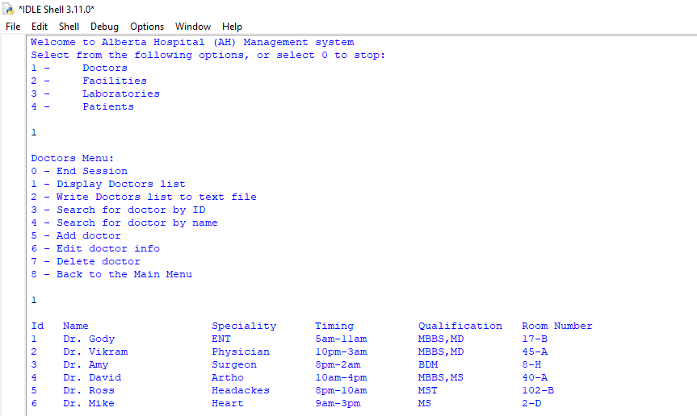

# Alberta Hospital Management system (AH_MS)

## Aim
Building a small-scale management system

## Concept
This management system supports basic data CRUD operations as well as report generation for easy sharing and analysis

## Built with
- [Python](https://www.python.org/)
- SQL
- [PostgreSQL](https://www.postgresql.org)

## Sample Page


## Installation
Install with pip:
```
$ pip install -r requirements.txt
```

### .env configuration
Create a .env file with these configurations:
```
HOST=<pg_hostname>
USER=<pg_username>
PASSWORD=<pg_password>
DATABASE=<pg_database_name>
```

## Run
In the terminal run:
```
python app.py
```
or
run app.py

## Contact
- Mail: alexanderking.aa@gmail.com
- GitHub: [Alexander](https://github.com/Anyaegbunam-Alexander)
